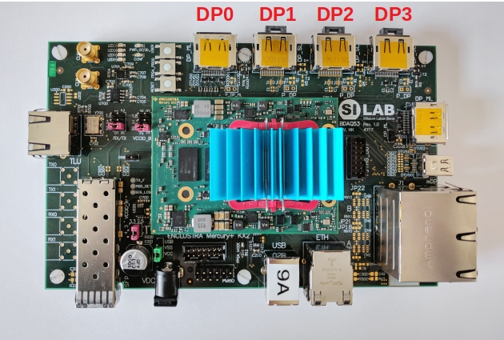

# Software Installation

Adding BDAQ support to the Yarr software requires one extra dependency and enabling the ***BDAQ controller*** for compilation. To achieve this, follow the instructions ahead.

## Dependencies

1. Install the [typical Yarr software dependencies](install.md#dependencies)
1. Install the following extra dependency

```bash
$ sudo yum install boost-devel
```

## Get the appropriate software version

BDAQ support is either on the *devel* branch or on an *appropriate tag*.

```bash
$ git clone -b devel https://github.com/Yarr/Yarr.git Yarr
```

## Compile the software

```bash
$ cd Yarr/
$ mkdir build
$ cd build
$ cmake3 "-DYARR_CONTROLLERS_TO_BUILD=Spec;Emu;Bdaq" ../
```

# Firmware

The BDAQ hardware must have one of the following firmwares deployed to its FPGA:

- **Recommended:** [1.2.0_BDAQ53_1LANE_RX640](https://gitlab.cern.ch/silab/bdaq53/uploads/936860f3e449cb8cd1a8fecc4f215318/1.2.0_BDAQ53_1LANE_RX640.tar.gz)
- [...](...)
- For more information, refer to: https://gitlab.cern.ch/silab/bdaq53/-/releases
- Firmware installation instructions: https://gitlab.cern.ch/silab/bdaq53/-/wikis/Bdaq-firmware-manager

# Connectivity

When running [*scanConsole*](scanconsole.md), the [connectivity configuration file ](scanconsole.md#Command%20Line%20Arguments) must reflect your setup, according to the mappings shown below:

## Command Driver (transmitter) mapping

| Software Identifier | DisplayPort |    BDAQ   |
|:-------------------:|:-----------:|:---------:|
|       "tx" : 0      |     DP 0    | CMD (AUX) |
|       "tx" : 0      |     DP 1    | CMD (AUX) |
|       "tx" : 0      |     DP 2    | CMD (AUX) |
|       "tx" : 0      |     DP 3    | CMD (AUX) |

## Aurora Receivers mapping

| Software Identifier | DisplayPort | BDAQ RX |
|:-------------------:|:-----------:|:-------:|
|       "rx" : 0      |     DP 0    |   RX 0  |
|       "rx" : 1      |     DP 0    |   RX 1  |
|       "rx" : 2      |     DP 0    |   RX 2  |
|       "rx" : 3      |     DP 0    |   RX 3  |
|       "rx" : 4      |     DP 1    |   RX 0  |
|       "rx" : 5      |     DP 2    |   RX 0  |
|       "rx" : 6      |     DP 3    |   RX 0  |

Refer to the figure below to identify the DisplayPort connectors in the BDAQ hardware.



# Module Testing

## 1DP Adapter

With the [Osaka 1DP Adapter](https://gitlab.cern.ch/itk-pixel-hybrid/rd53a_testboard_japan/-/blob/master/1DP_Adapter_Board_V3.pdf), only ***DP 0*** of the BDAQ hardware can be used. The command driver and receivers mappings are shown in the tables below:

## Command Driver (transmitter) mapping

| Software Identifier | Displayport |    BDAQ   |    1DP Adapter    |
|:-------------------:|:-----------:|:---------:|:-----------------:|
|       "tx" : 0      |     DP 0    | CMD (AUX) | Chip 1, CMD (AUX) |
|       "tx" : 0      |     DP 0    | CMD (AUX) | Chip 2, CMD (AUX) |
|       "tx" : 0      |     DP 0    | CMD (AUX) | Chip 3, CMD (AUX) |
|       "tx" : 0      |     DP 0    | CMD (AUX) | Chip 4, CMD (AUX) |

## Aurora Receivers mapping

| Software Identifier | DisplayPort | BDAQ RX |  1DP Adapter  |
|:-------------------:|:-----------:|:-------:|:-------------:|
|       "rx" : 0      |     DP 0    |   RX 0  | Chip 1, GTX 0 |
|       "rx" : 1      |     DP 0    |   RX 1  | Chip 2, GTX 0 |
|       "rx" : 2      |     DP 0    |   RX 2  | Chip 3, GTX 0 |
|       "rx" : 3      |     DP 0    |   RX 3  | Chip 4, GTX 0 |

### Sample connectivity configuration file for the 1DP Adapter:
```bash
{
    "chipType" : "RD53A",
    "chips" : [
        {
            "config" : "configs/chip1.json",
            "tx" : 0,
            "rx" : 0,
            "enable" : 1,
            "locked" : 0
        },
        {
            "config" : "configs/chip2.json",
            "tx" : 0,
            "rx" : 1,
            "enable" : 1,
            "locked" : 0
        },
        {
            "config" : "configs/chip3.json",
            "tx" : 0,
            "rx" : 2,
            "enable" : 1,
            "locked" : 0
        },
        {
            "config" : "configs/chip4.json",
            "tx" : 0,
            "rx" : 3,
            "enable" : 1,
            "locked" : 0
        }

    ]
}
```

## 4DP Adapter

A suggested setup is connecting ***DisplayPort 1***, ***DisplayPort 2***, ***DisplayPort 3*** and ***DisplayPort 4***, of the [Osaka 4DP Adapter](https://gitlab.cern.ch/itk-pixel-hybrid/rd53a_testboard_japan/-/blob/master/Adapter_Board_V3.pdf), respectively, to ***DP 0***, ***DP 1***, ***DP 2*** and ***DP 3*** of the BDAQ hardware. With this setup, the command driver and receivers mappings are as follows:

## Command Driver (transmitter) mapping

| Software Identifier | Displayport |    BDAQ   |    1DP Adapter    |
|:-------------------:|:-----------:|:---------:|:-----------------:|
|       "tx" : 0      |     DP 0    | CMD (AUX) | Chip 1, CMD (AUX) |
|       "tx" : 0      |     DP 1    | CMD (AUX) | Chip 2, CMD (AUX) |
|       "tx" : 0      |     DP 2    | CMD (AUX) | Chip 3, CMD (AUX) |
|       "tx" : 0      |     DP 3    | CMD (AUX) | Chip 4, CMD (AUX) |

## Aurora Receivers mapping

| Software Identifier | DisplayPort | BDAQ RX |  4DP Adapter  |
|:-------------------:|:-----------:|:-------:|:-------------:|
|       "rx" : 0      |     DP 0    |   RX 0  | Chip 1, GTX 0 |
|       "rx" : 1      |     DP 0    |   RX 1  | Not supported |
|       "rx" : 2      |     DP 0    |   RX 2  | Not supported |
|       "rx" : 3      |     DP 0    |   RX 3  | Not connected |
|       "rx" : 4      |     DP 1    |   RX 0  | Chip 2, GTX 0 |
|       "rx" : 5      |     DP 2    |   RX 0  | Chip 3, GTX 0 |
|       "rx" : 6      |     DP 3    |   RX 0  | Chip 4, GTX 0 |

*The ***GTX 1***, ***GTX 2*** and ***GTX 3***, for all the Chips, are indeed not reachable.

### Sample connectivity configuration file for the 4DP Adapter:
```bash
{
    "chipType" : "RD53A",
    "chips" : [
        {
            "config" : "configs/chip1.json",
            "tx" : 0,
            "rx" : 0,
            "enable" : 1,
            "locked" : 0
        },
        {
            "config" : "configs/chip2.json",
            "tx" : 0,
            "rx" : 4,
            "enable" : 1,
            "locked" : 0
        },
        {
            "config" : "configs/chip3.json",
            "tx" : 0,
            "rx" : 5,
            "enable" : 1,
            "locked" : 0
        },
        {
            "config" : "configs/chip4.json",
            "tx" : 0,
            "rx" : 6,
            "enable" : 1,
            "locked" : 0
        }

    ]
}
```

# RD53A register configuration
...

# BDAQ controller parameters (bdaqCfg.json)
...

