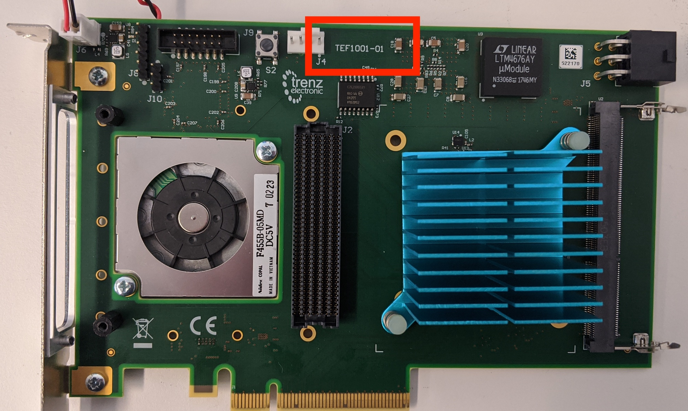
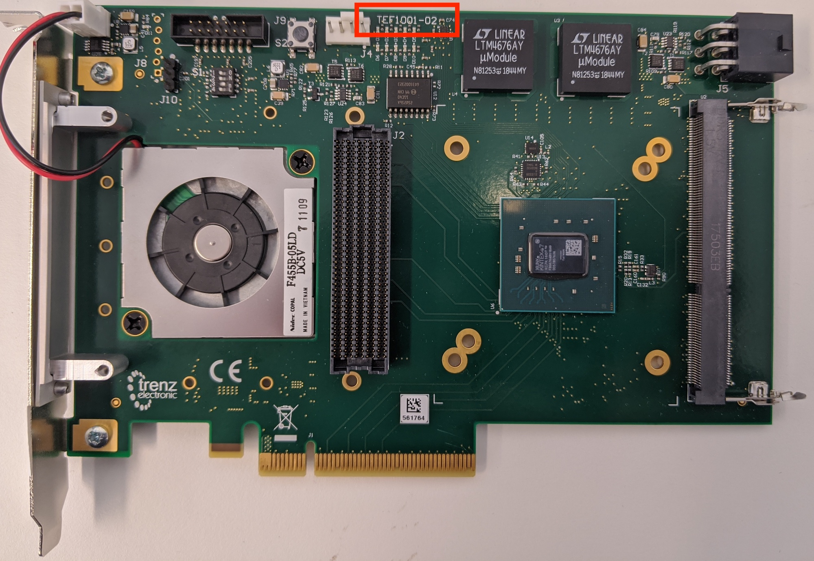
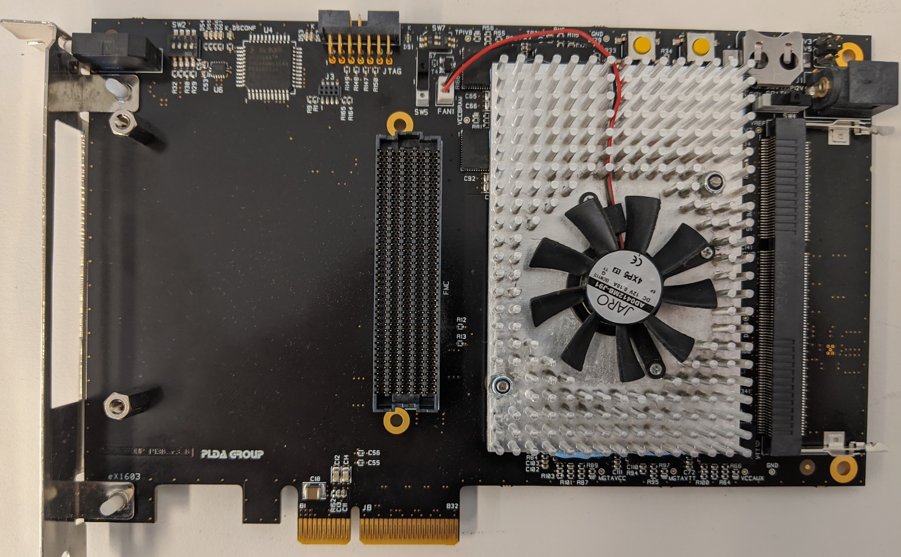
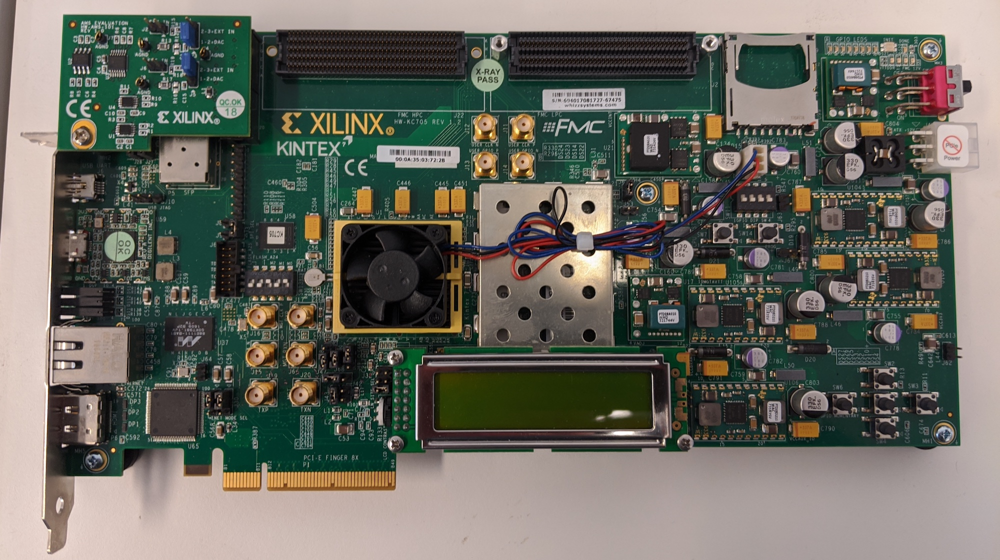
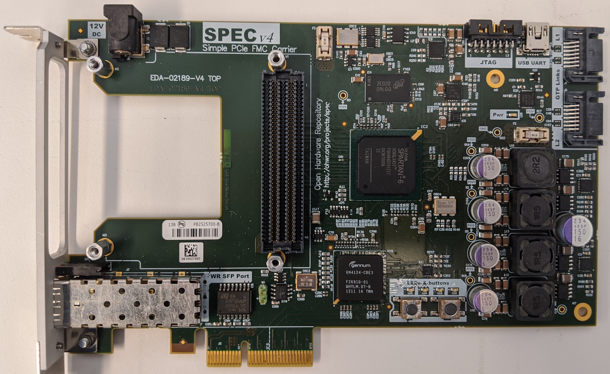
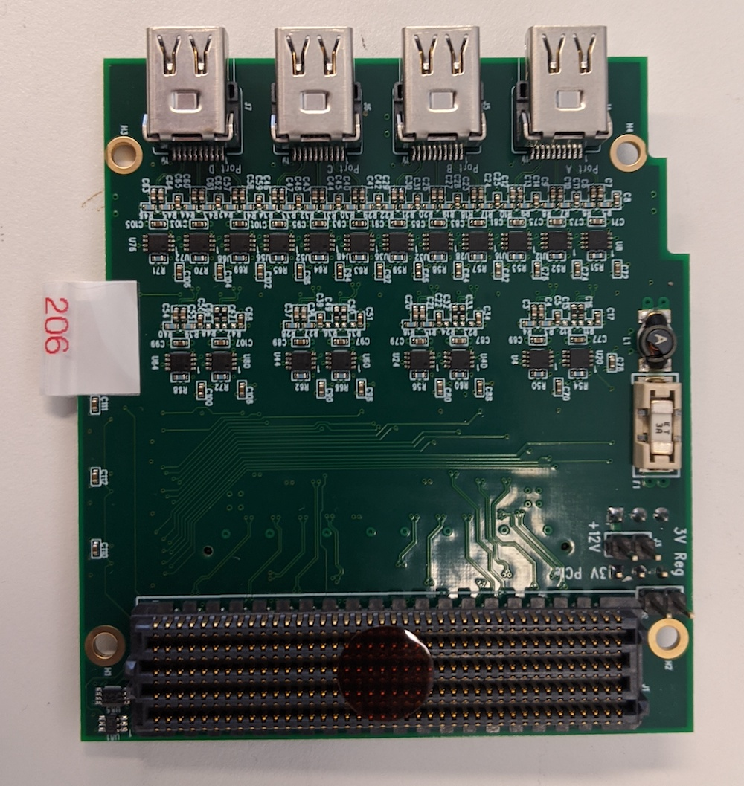
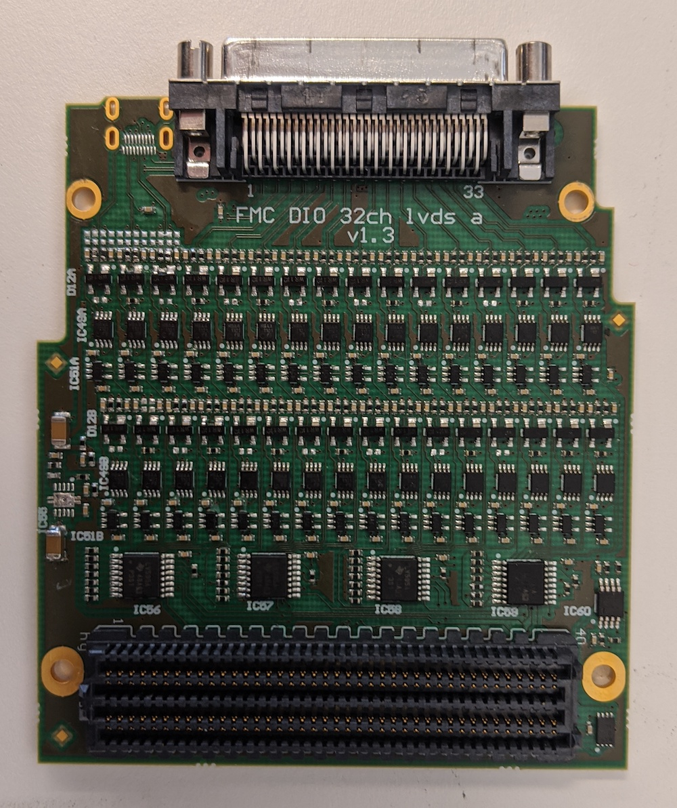

# Firmware Guide

## Download and flash Firmware

In order to flash the firmware, download the following script: [flash.sh](http://yarr.web.cern.ch/yarr/firmware/flash.sh)

```bash
wget --backups=1 http://yarr.web.cern.ch/yarr/firmware/flash.sh
```

The script can be used in two ways:

1. Run it by itself (without an argument) and it will ask some questions about what kind of configuration you desire. It will then download the latest firmware and proceed to flash the firmware to the FPGA and PROM.
2. Run it with an already downloaded bit-file as an argument and it will proceed to flash this firmware to the FPGA card. It will still ask what FPGA card you have as this specifies how to flash the firmware exactly.

Once the firmware is flashed please reboot your computer. Also remember that you should power-down all connected FE chips during FPGA programming and that it might be necessary to configure the FPGA once before one can successfully communicate with FE chips (for example by simply running the scanConsole).

## Further information for Questionaire

### FPGA Board Type

#### Trenz TEF1001

The Trenz TEF1001 comes in two revisions which can be identified by the label on the card.
Specific information about the cards can be found on their [wiki](https://wiki.trenz-electronic.de/display/PD/TEF1001+TRM).


Revision 1 specifics:

* Requires to be powered via the PCIe Molex connector.


Revision 2 specifics:

* Can be powered via PCIe Molex or directly from PCIe.
* DIP switches should be set to ``0,0,1,0`` (where the bits are ordered like this ``4,3,2,1``, same setting as in the picture) 

#### PLDA XpressK7

There are two version of the XpressK7 card which differ in the specific FPGA type they use denoted by the 160 and 325. The majority of all people should have the 325 version. The only way to identify in case you do not know which version you have is to connect a JTAG programmer and scan the JTAG chain in Vivado, it will tell you the exact FPGA type. In case you try to flash the wrong firmware version, it will simply fail and tell you that the connected FPGA does not match the one the bit-file was created for.



As this card is not produced anymore by PLDA and you require more information, reach out to the ``yarr-user`` mailing list.

#### Xilinx KC705



#### CERN SPEC Spartan6

Only used for FE-I4 and FE65-P2 type chips.


### FMC card

#### Ohio card

Used for RD53 and STAR chip readout.


#### Creotech 32ch VHDCI

Used for FE-I4 readout.


### FE Chip Type

Supported chips are:

- FE-I4
- FE65-P2
- RD53A/B
- ABC/HCCStar

### RX Speed

Not all speeds might be supported for all chips this is somewhat chip dependent:

- FE-I4: 160Mbps
- FE65-P2: 160Mbps
- RD53A/B: 160Mbps/640Mbps/1280Mbps
- ABC/HCCStar: 320Mbps

Make sure to change the chip configuration to transmit at the right speed. Details can be found on the respective chip page.

### Channel Configuration

Not all configuration are available for all chip types:

- FE-I4: tbd
- FE65-P2: 1x1
- RD53A/B: 4x4, 16x1
- ABC/HCCStar: 4x1

If the channel configuration is ZxY then Y is number of lanes per channel (only applies to RD53A/B) and Z is the total number of channels, where the channel typically refers to one chip (or hybrid in case of strips). If one wants to read out 4 RD53A/B single chips: select 4x4. If one wants to read out one RD53A/B quad module with one DP per chip: use 4x4. But if one wants to read out an RD53A/B chip with only 1 DP port: select 16x1 (i.e. 4 channels with 1 lane per DP).
