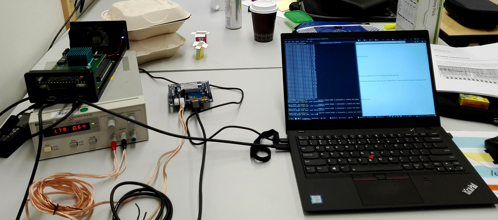
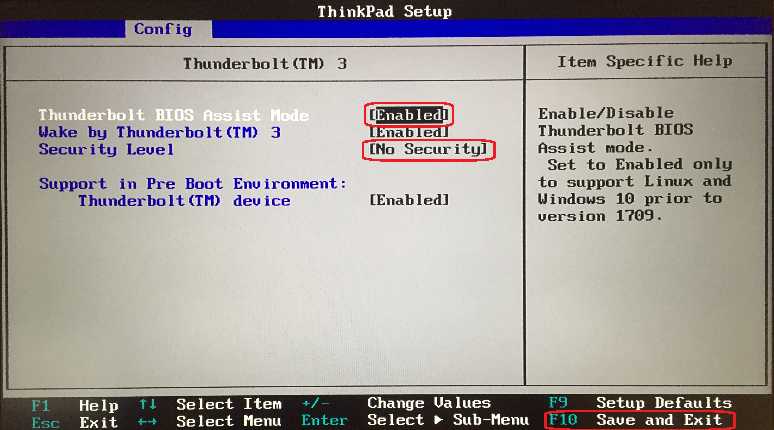

# External PCIe Setup

It is possible to run YARR without a dedicated computer through a PCIe to Thunderbolt 3 adapter. You need:

 * a computer with Thunderbolt 3 port (e.g. Thinkpad X1 Carbon or Dell Latitude E5591, both successfully tested);
 * a PCIe to Thunderbolt 3 adapter (successfully tested [this one](https://www.startech.com/CH/en/Cards-Adapters/Slot-Extension/thunderbolt-3-pcie-expansion-chassis~TB31PCIEX16) which can be bought e.g. from [Amazon.com](https://www.amazon.com/StarTech-com-Thunderbolt-PCIe-Expansion-Chassis/dp/B075RJHLB4/ref=sr_1_3) or [microspot](https://www.microspot.ch/de/computer-gaming/pc-komponenten/geh%C3%A4use--c586000/startech-com-pcie-erweiterungsgeh%C3%A4use--p0001424460) in Switzerland;
 * a 1.5-2m long TB3 to TB3 cable, whereas good USB-C to USB-C should also work and is cheaper.

## Important Information
 * All Thunderbolt 3 support settings in BIOS should be enabled as described [here](https://it.nmu.edu/docs/thinkpad-thunderbolt-3-dock-set).
 * You might have to switch on the direct access and authorise the Thunderbolt 3 device as shown below.
 * The case only powers up if connected to the computer. Otherwise it is in a low-power mode and the connected chip loses its configuration.
 * Currently, the ``specNum`` registered by the computer increases by one on each reconnection of the external PCIe card.
     * The number has either to be changed in the ``specCfg.json`` accordingly (up to maximum 9), or
     * the kernel driver has to be reloaded ``sudo modprobe -r specDriver && sudo modprobe -v specDriver``

