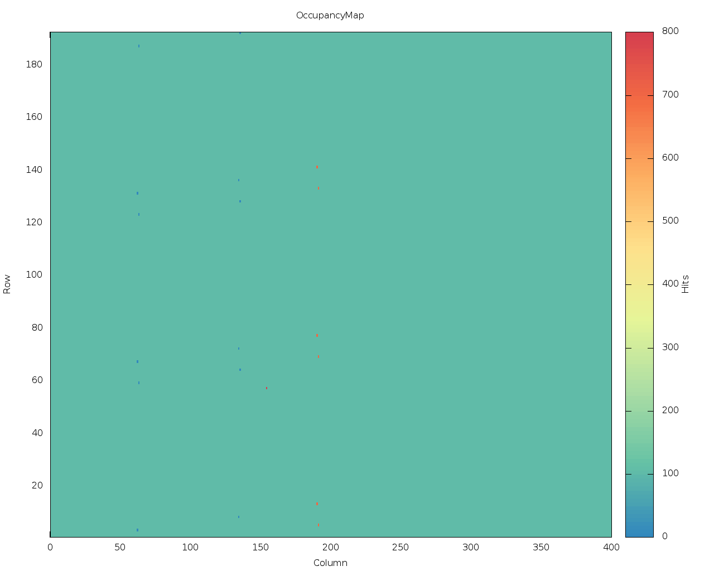
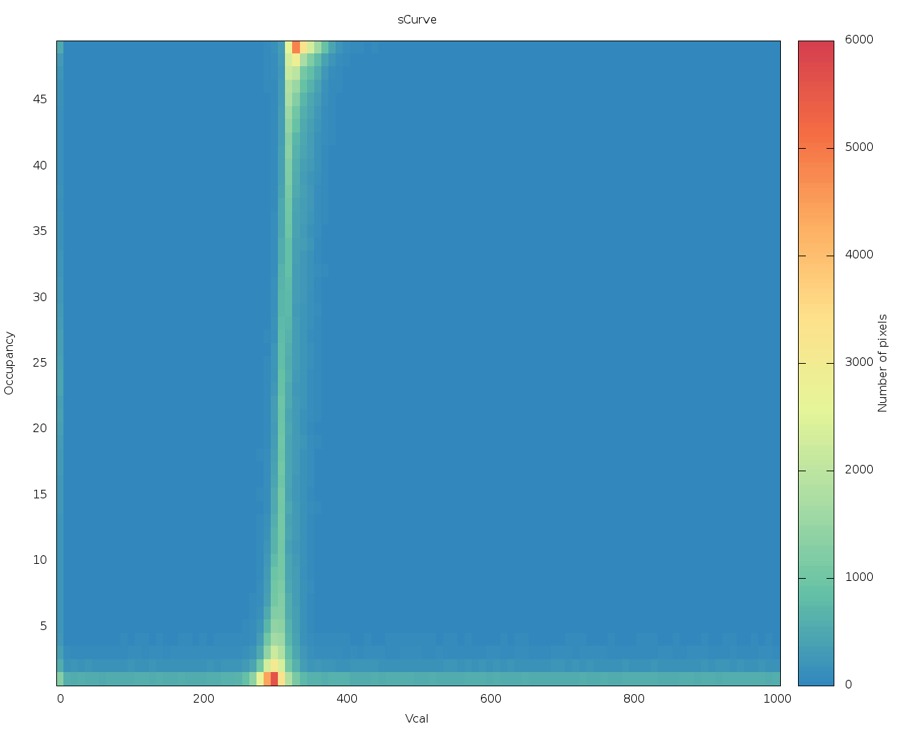
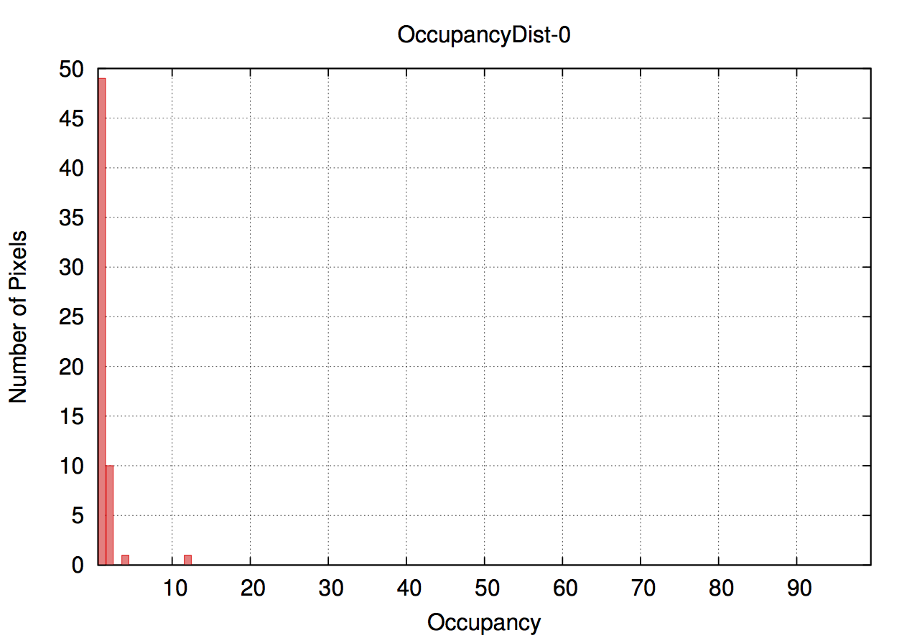
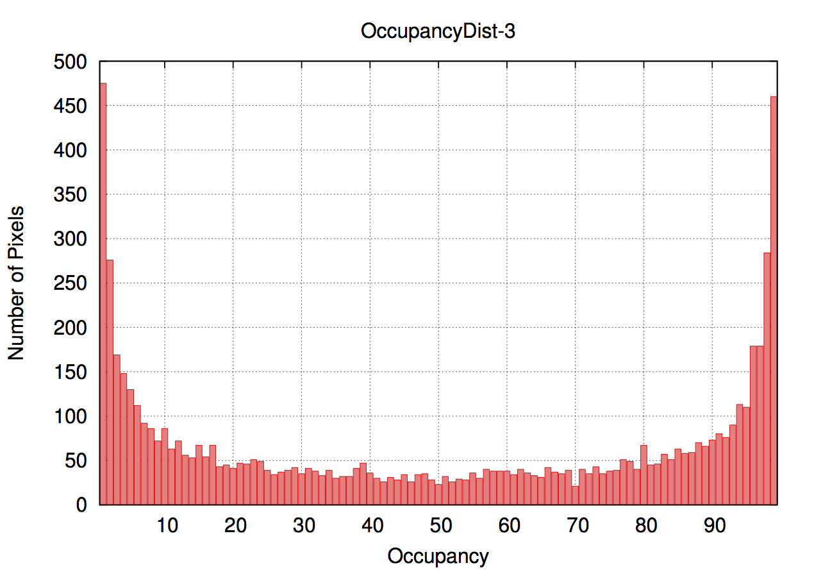
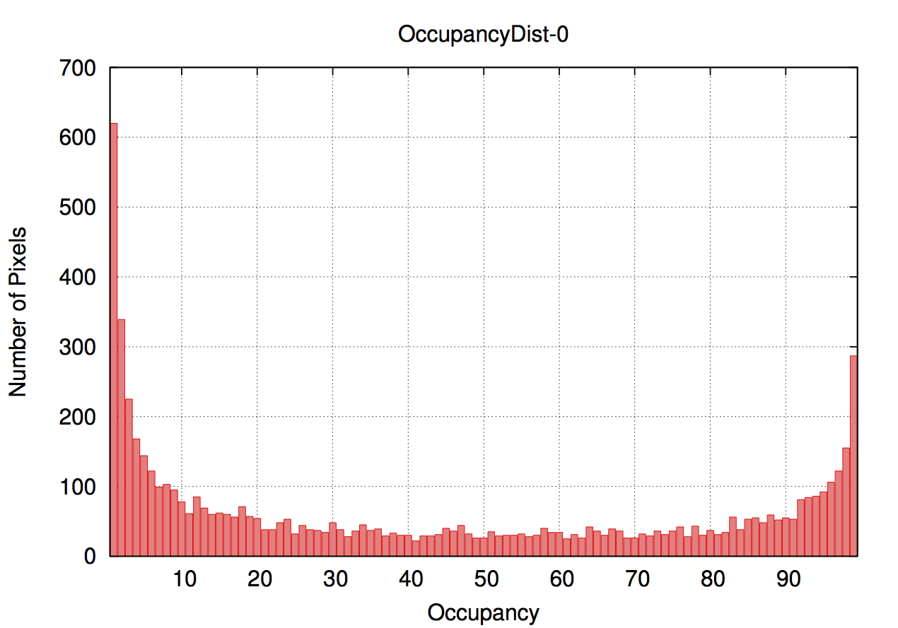
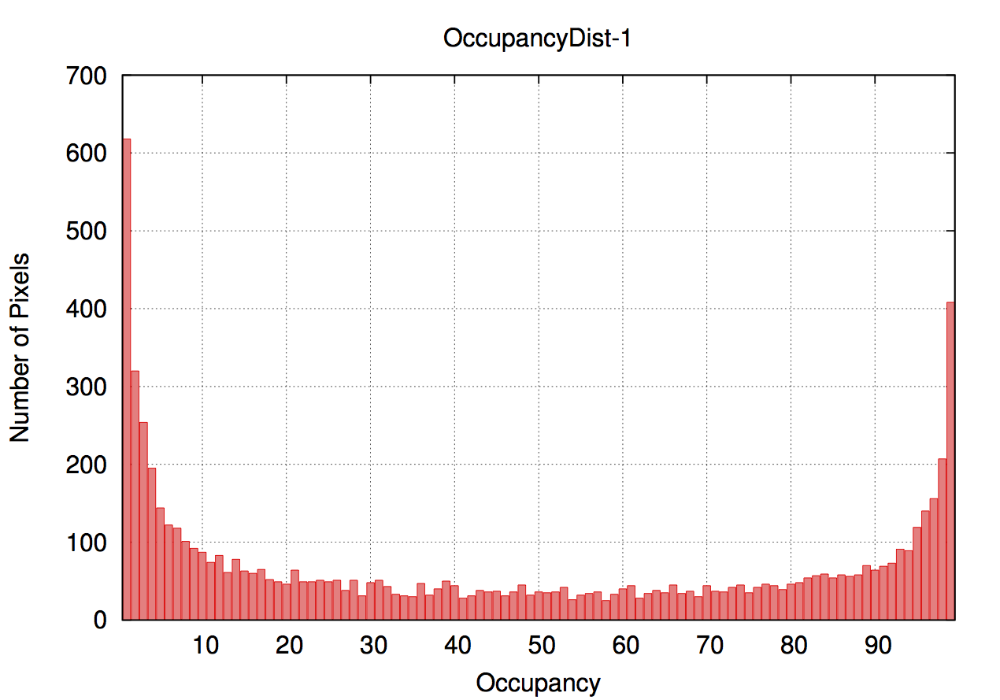
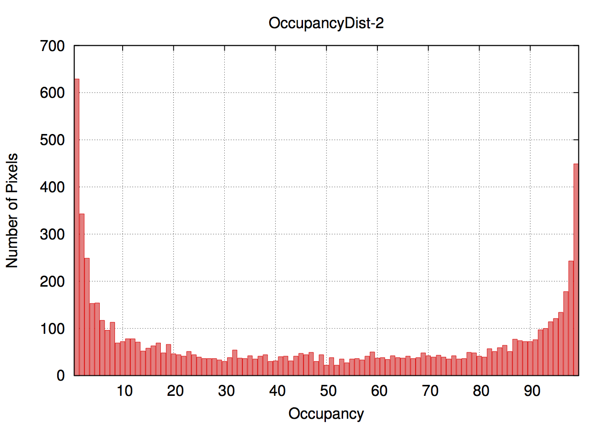
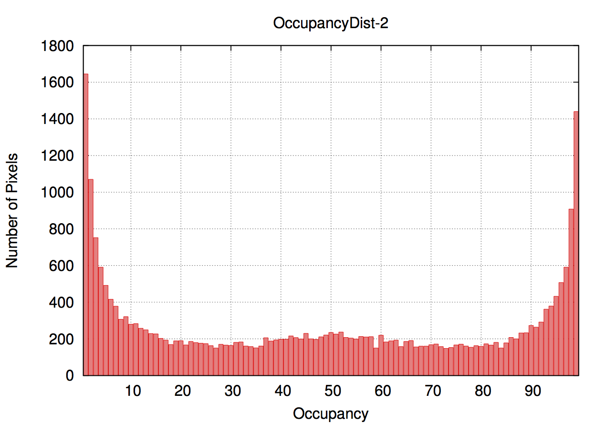
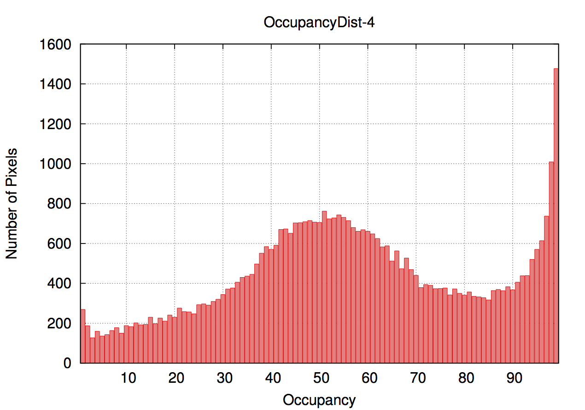
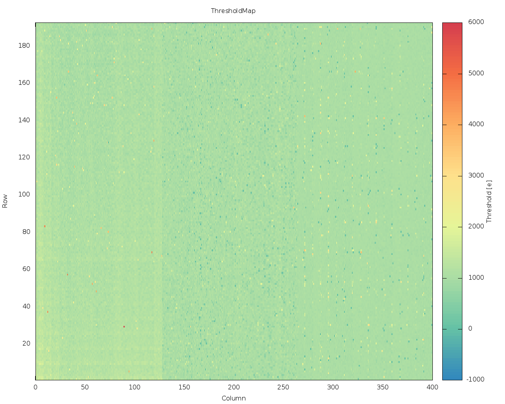

# RD53A testing with the Single Chip Card
More details about the SCC can be found here: [Single Chip Card](https://twiki.cern.ch/twiki/bin/viewauth/RD53/RD53ATesting#RD53A_Single_Chip_Card_SCC)

## Jumper configuration and power on


Default settings for operation in **LDO mode**

- PWR_A and PWR_D: VINA and VIND (LDO operation)
- VDD_PLL_SEL: VDDA (PLL driver from VDDA supply)
- VDD_CML_SEL: VDDA (CML driver from VDDA supply)
- VREF_ADC (internal ADC voltage reference)
- IREF_IO (internal current refetrence)
- IREF_TRIM: Jumper to 3 to set the internal reference current at 4 μA
- Jumpers JP10 and JP11 should be closed in order to use LANE 2 and 3
- Add a PLL_RST jumper
- Add a 5 kΩ resistor for R3 to pull up Vctrl to Vdd (back side of the SCC)

**Make sure that the jumper configuration marked in red is correct before powering the chip!!! Applying too high voltage may kill the chip.**

After all jumpers are placed on the SCC, connect the DisplayPort cable to DP1 and power cable to PWR_IN.

Set the power supply to <span style="color:red">**1.85**</span> V, the current should be around 0.5 A and power on the chip. For the LDO operation, e.g. the jumper configuration shown in previous figure, make sure <span style="color:red"> not to apply higher voltage than **1.85 V**</span>.

# Scan Console for RD53A

More information about ScanConsole can be found on the main page: [ScanConsole](ScanConsole).

## Digital Scan

To run a digital scan for RD53A with the default configuration execute the following command:
```bash
bin/scanConsole -r configs/controller/specCfg.json -c configs/connectivity/example_rd53a_setup.json -s configs/scans/rd53a/std_digitalscan.json -p
```
The occupancy map after a successful digital scan is given below.


## Analog Scan

To run a analog scan for RD53A with the default configuration execute the following command:
```bash
bin/scanConsole -r configs/controller/specCfg.json -c configs/connectivity/example_rd53a_setup.json -s configs/scans/rd53a/std_analogscan.json -p
```
The occupancy map after a successful analog scan is given below.

- The implementation of the analog scan for the synchronous FE is coming soon!

### Analog scan for only differential FrontEnd

```bash
bin/scanConsole -r configs/controller/specCfg.json -c configs/connectivity/example_rd53a_setup.json -s configs/scans/rd53a/diff_analogscan.json -p
```

- The pattern in the differential FE is expected for the default configuration of Vff.

## Threshold Scan

To run a threshold scan for RD53A with the default configuration execute the following command:
```bash
bin/scanConsole -r configs/controller/specCfg.json -c configs/connectivity/example_rd53a_setup.json -s configs/scans/rd53a/std_thresholdscan.json -p
```
The noise and threshold mean value will be given in the output of the code, for example:
```text
[0] Threashold Mean = 3245.7 +- 801.668
[0] Noise Mean = 125.784 +- 312.594
```
Example of the s-curve, threshold distribution, threshold map and noise distribution are given below:



## Time over Threshold Scan

```bash
bin/scanConsole -r configs/controller/specCfg.json -c configs/connectivity/example_rd53a_setup.json -s configs/scans/rd53a/std_totscan.json -t 5000 -p
```
The ToT mean value will be given in the output of the code, for example:
```text
[0] ToT Mean = 3.54881 +- 3.00684
```
Example distributions are coming soon!


## Tuning

The tuning should be started with a global tuning of the linear FrontEnd. The example command with a target threshold of 2500e is:
```bash
bin/scanConsole -r configs/controller/specCfg.json -c configs/connectivity/example_rd53a_setup.json -s configs/scans/rd53a/lin_tune_globalthreshold.json -t 2500 -p
```
|  |  |  |  |  |  |
|:---:|:---:|:---:|:---:|:---:|:---:|


After the global tuning of the linear FrontEnd, one should tune the differential with the same target threshold:
```bash
bin/scanConsole -r configs/controller/specCfg.json -c configs/connectivity/example_rd53a_setup.json -s configs/scans/rd53a/diff_tune_globalthreshold.json -t 2500 -p
```
|  |  |  |  |  |  |
|:---:|:---:|:---:|:---:|:---:|:---:|

The the tuning of the synchronous FrontEnd is in progress. Currently the linear FrontEnd can be tuned bellow 2500e.  Note: *The TDAC values are not reset with the global threshold tuning.*

Then, pixel tuning is performed on all FrontEnds simultaneously.
```bash
bin/scanConsole -r configs/controller/specCfg.json -c configs/connectivity/example_rd53a_setup.json -s configs/scans/rd53a/std_tune_pixelthreshold.json -t 2500 -p
```
|  |  |  |  |  |
|:---:|:---:|:---:|:---:|:---:|


Running the threshold scan shows the result of the tuning:
```text
[0] Threashold Mean = 2576.14 +- 351.621
[0] Noise Mean = 107.643 +- 554.819
```




### Recommended tuning procedure:
- Digital scan
- Analog scan
- Global tuning of the linear FE
- Global tuning of the differential FE
- Pixel tuning
- Threshold scan


# Loop Actions

List of available loop actions and their configuration parameters.

## Rd53aTriggerLoop
Will repeatably send a 512-bit command from the burst buffer to the FE.

Config parameters:
    
- count ``<int>``: number of injections, if 0 will run for specified time (default 50/100)
- delay ``<int>``: time gap in bunch crossings between injection and trigger, should be divisible by 8 (default 56)
- extTrigger ``<bool>``: enable external triggering, requires proper trigger processors configuration (default false)
- frequency ``<int>``: trigger(/injection)frequency in Hz (default 5000)
- noInject ``<bool>``: disable charge injection (e.g. for noise scan) (default false)
- time ``<int>``: time in seconds, if count is set to 0 will run for this amount of time (default 0)
- edgeMode ``<bool>``: switches cal injection command to edge mode, e.g. for digital scan (default false)

## Rd53aCoreColLoop
Loops of core columns in specified pattern

Config parameters:
    
- max ``<int>``: upper bound of cores to scan
- min ``<int>``: lower bound of cores to scan
- step ``<int>``: step size (1 will scan all cores, more than 1 will skip cores)
- nSteps ``<int>``: how many steps should be used to scan over cores

## Rd53aMaskLoop
Loops over pixels. All pixels in one core column are serialized on the following fashion.
    
```
...
==Core Col 2==
71  ..... 127
.   .....  .
66  ..... 121
65  ..... 120
64  ..... 119
==Core Col 1==
7   15  ..  63
6   14  ..  62
5   13  ..  61
4   12  ..  60
3   11  ..  59
2   10  ..  58
1   9   ..  57
0   8   ..  56
==Core Col 0==
```

The maximum of the loops defines how many pixels should be activated at one time. E.g. if the max is 64 that means every 64th pixel (1 pixel per core) and requires 64 steps to loop over all pixels.

Config parameters:

 - max ``<int>``: number of mask stages
 - min ``<int>``: mask stage to start with
 - step ``<int>``: step size of mask stage

