# RD53A testing with the Single Chip Card
More details about the SCC can be found here: [Single Chip Card](https://twiki.cern.ch/twiki/bin/viewauth/RD53/RD53ATesting#RD53A_Single_Chip_Card_SCC)

## Jumper configuration and power on


Default settings for operation in **LDO mode**

- PWR_A and PWR_D: VINA and VIND (LDO operation)
- VDD_PLL_SEL: VDDA (PLL driver from VDDA supply)
- VDD_CML_SEL: VDDA (CML driver from VDDA supply)
- VREF_ADC (internal ADC voltage reference)
- IREF_IO (internal current refetrence)
- IREF_TRIM: Jumper to 3 to set the internal reference current at 4 μA
- Jumpers JP10 and JP11 should be closed in order to use LANE 2 and 3
- Add a PLL_RST jumper
- Add a 5 kΩ resistor for R3 to pull up Vctrl to Vdd (back side of the SCC)

**Make sure that the jumper configuration marked in red is correct before powering the chip!!! Applying too high voltage may kill the chip.**

After all jumpers are placed on the SCC, connect the DisplayPort cable to DP1 and power cable to PWR_IN.

Set the power supply to <span style="color:red">**1.8**</span> V, the current should be around 0.5 A and power on the chip. For the LDO operation, e.g. the jumper configuration shown in previous figure, make sure <span style="color:red"> not to apply higher voltage than **1.8 V**</span>.

# Scan Console for RD53A

The general structure of the Scan Console commands is:

```bash
bin/scanConsole -r configs/controller/specCfg.json -c configs/connectivity/example_rd53a_setup.json -s configs/scans/rd53a/<type of scan>.json -p
```
which specifies the controller (`-r`), the chip list and chip type (`-c`), and the scan (`-s`). The option `-p` selects plotting so plots are produced after the scans.
If you run a scan for the first time, it will create a default configuration for the chip along with running the scan.

To create the default chip configuration without running a scan:
```bash
bin/scanConsole -r configs/controller/specCfg.json -c configs/connectivity/example_rd53a_setup.json
```

More general information about hwo to use the scanConsole, can be found on the main page: [ScanConsole](scanconsole). This page details each of the configuration settings. 

In case you run into problems or have abnormal results please consult the troubleshooting page here: [Troubleshooting](troubleshooting)

## Tuning routine

Examples of the result and how to run different scans is shown below. If you have mastered the basics, you probably just need this information.
Basics tuning routine:

- `std_digitalscan.json` (with `-m 1` to reset masks)
- `std_analogscan.json`
- `diff_tune_globalthreshold.json` (good starting threshold target is 1000e, resets prev. TDACs)
- `diff_tune_pixelthreshold.json` (1000e target again)
- `diff_tune_finepixelthreshold.json` (1000e target again)
- `lin_tune_globalthreshold.json` (good starting threshold target is 2000e, resets prev. TDACs)
- `lin_tune_pixelthreshold.json` (2000e again)
- `lin_retune_globalthreshold.json` (now retuning from 2000e to 1000e target)
- `lin_retune_pixelthreshold.json` (1000e again)
- `lin_tune_finepixelthreshold.json` (1000e again)
- `syn_tune_globalthreshold.json` (can be as low as 1000e, but keep noise occupancy in check)
- `std_thresholdscan.json` (verify thresholds, use root plot script for nice plots, see [here](rootscripts))
- `std_totscan.json` (with target charge equal to MIP, e.g. 12ke)
- `std_noisescan.json` (measure noise occupancy, will mask noisy pixels, might fail if too noisy)

If you also want to tune the ToT conversion we need to insert those tunings and also some threshold retunings. For a bsic routine including those see below:

- `std_digitalscan.json` (with `-m 1` to reset masks)
- `std_analogscan.json`
- `diff_tune_globalthreshold.json` (good starting threshold target is 1000e, resets prev. TDACs)
- `diff_tune_pixelthreshold.json` (1000e target again)
- `diff_tune_globalpreamp.json` (use mid of the range ToT values, e.g. 10000e at 8ToT)
- `diff_tune_pixelthreshold.json` (1000e target again)
- `diff_tune_finepixelthreshold.json` (1000e target again)
- `lin_tune_globalthreshold.json` (good starting threshold target is 2000e, resets prev. TDACs)
- `lin_tune_pixelthreshold.json` (2000e again)
- `lin_retune_globalthreshold.json` (now retuning from 2000e to 1000e target)
- `lin_retune_pixelthreshold.json` (1000e again)
- `lin_tune_globalpreamp.json` (use mid of the range ToT values, e.g. 10000e at 8ToT)
- `lin_retune_pixelthreshold.json` (1000e again)
- `lin_tune_finepixelthreshold.json` (1000e again)
- `syn_tune_globalthreshold.json` (can be as low as 1000e, but keep noise occupancy in check)
- `syn_tune_globalpreamp.json` (use mid of the range ToT values, e.g. 10000e at 8ToT)
- `syn_tune_globalthreshold.json` (can be as low as 1000e, but keep noise occupancy in check)
- `std_thresholdscan.json` (verify thresholds, use root plot script for nice plots, see [here](rootscripts))
- `std_totscan.json` (with target charge equal to MIP, e.g. 12ke)
- `std_noisescan.json` (measure noise occupancy, will mask noisy pixels, might fail if too noisy)

## Common misconceptions and issues

Some general tips when operating RD53A with YARR:

- Most scans use a mask loop to scan over pixels, this (currently) ignores the enable mask written to the config. Only data-taking like scans (e.g. noisescan or external trigger scan) will use the enable mask written to the chip config. If for example you run a noise scan and it is completly empty, check the enable mask in your config.
- The target charge command line argument is interpreted in different ways depending on the scan. For a threshold tuning it is used as the threshold target, for a totscan it is used as the value of charge for the injections, and in case of a preamp tuning it is also used the target charge for achieve the specified ToT (second argument).
- There can be interference between the analog FEs, for instance when one FE is badly tuned and very noisy it might radiate noise into other FEs. Hence one should make sure that even when only using one FE type, that the other FEs are in a decent state (e.g. high threshold).
- Auto-zeroing is performed by the hardware and therefore the auto-zero frequency is set by the hardware controller.
- Auto-zeroing can cause transients on the power line which can cause other FEs to be noisy. So if someone chooses not to use the sync FE, one should also turn-off auto-zeroing in the controller config (by setting the auto-zero word to `0`).

## Digital Scan

To run a digital scan for RD53A with the default configuration execute the following command:
```bash
bin/scanConsole -r configs/controller/specCfg.json -c configs/connectivity/example_rd53a_setup.json -s configs/scans/rd53a/std_digitalscan.json -p
```
An example of occupancy map after a successful digital scan is given below.


## Analog Scan

To run a analog scan for RD53A with the default configuration execute the following command:
```bash
bin/scanConsole -r configs/controller/specCfg.json -c configs/connectivity/example_rd53a_setup.json -s configs/scans/rd53a/std_analogscan.json -p
```
An example of the occupancy map after a successful analog scan is given below.


### Analog scan for only one analog FrontEnd

```bash
bin/scanConsole -r configs/controller/specCfg.json -c configs/connectivity/example_rd53a_setup.json -s configs/scans/rd53a/diff_analogscan.json -p
```

- There are similar scan configs for the linear and sync FE

## Threshold Scan

To run a threshold scan for RD53A with the default configuration execute the following command:
```bash
bin/scanConsole -r configs/controller/specCfg.json -c configs/connectivity/example_rd53a_setup.json -s configs/scans/rd53a/std_thresholdscan.json -p
```

Config parameters for ``InjVcalDiff``:  
- max <int>: maximum value of InjVcalDiff
- min <int>: minimum value of InjVcalDiff
- step <int>: step size of InjVcalDiff (do not use a step size larger than 10)  
The injected charge in units of electrons is roughly 10*InjVcalDiff. Make sure that this is adequate for the expected threshold.
For an untuned chip with the default configuration, a ``max`` of larger than 400 should cover the threshold range.  
The threshold and noise mean and dispersion value (for everything scanned) will be given in the output of the code, for example:
```text
[0] Threashold Mean = 3245.7 +- 801.668
[0] Noise Mean = 125.784 +- 312.594
```
Example of the s-curve, threshold distribution, threshold map and noise distribution are given below:


c
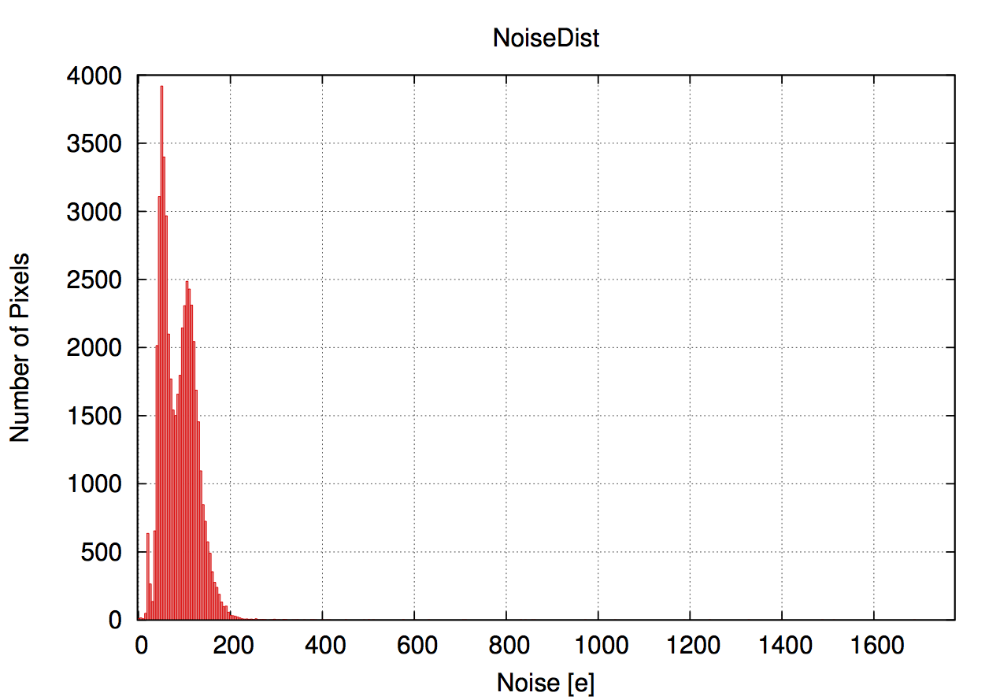


## Tuning
RD53a has 3 FEs: synchronous, differential, and linear. Each FE needs to be tuned independently. The full tuning procedure is described in the Tuning Routine section.

The tuning usually starts by tuning the global threshold DAC of the FrontEnd you want to tune:

- `DiffVth1` for the differential FE
- `SyncVth` for the synchronous FE
- `LinVth` for the linear FE

Below is an example of tuning the global threshold of the linear FE to 2500e. The goal is to reach 50% occupancy, this usually looks like a symmetric bathtub when the per pixel threshold is untuned.
In a similar manner the differential and synchronous global threshold DAC can be tuned.

```bash
bin/scanConsole -r configs/controller/specCfg.json -c configs/connectivity/example_rd53a_setup.json -s configs/scans/rd53a/lin_tune_globalthreshold.json -t 2500 -p
```
|  |  |  |  |  |  |
|:---:|:---:|:---:|:---:|:---:|:---:|

**Plots to be updated**
Then, the pixel tuning can be performed. See below an example of tuning the differential pixel TDACs to 2500e. The initial bathtub of the global threshold tune appear again, but with each step the values should converge more and more towards the center. In a similar manner the pixel TDACs of the linear FE can be tuned.

```bash
bin/scanConsole -r configs/controller/specCfg.json -c configs/connectivity/example_rd53a_setup.json -s configs/scans/rd53a/diff_tune_pixelthreshold.json -t 2500 -p
```
| 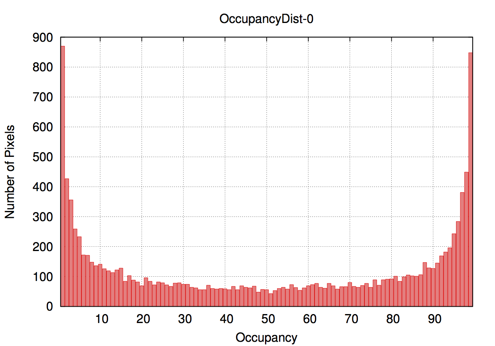 |  |  |  |  |
|:---:|:---:|:---:|:---:|:---:|

Once the full tuning routine (as outlined in the beginning of this page) has been performed, you can verify the tuning with a threshold scan:

```text
[0] Threashold Mean = 1050.66 +- 182.54
[0] Noise Mean = 161.395 +- 144.716

```
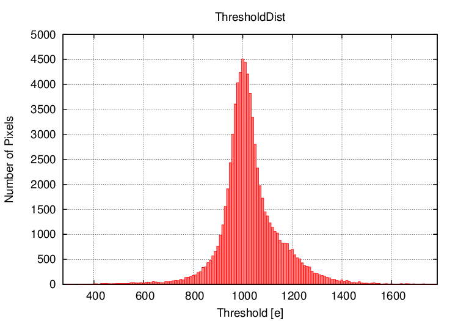
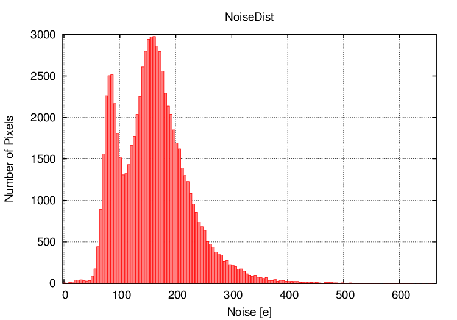
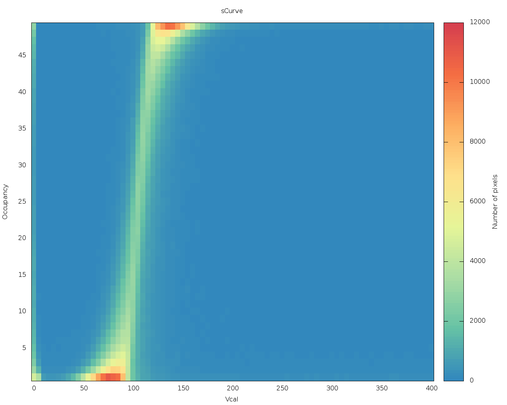


## Time over Threshold Scan
Before performing the time over threshold scan, one should first tune each FE.
```bash
bin/scanConsole -r configs/controller/specCfg.json -c configs/connectivity/example_rd53a_setup.json -s configs/scans/rd53a/diff_tune_globalpreamp.json -t 10000 8 -p
```

This command has the same format as all other scans, except for the `-t 10000 8`, which sets the target charge to `10000` and the TOT to `8`.

Similarly, the totscan also requires the user to specify the target charge, in this case `10000`.

```bash
bin/scanConsole -r configs/controller/specCfg.json -c configs/connectivity/example_rd53a_setup.json -s configs/scans/rd53a/std_totscan.json -p -t 10000
```

The ToT mean value will be given in the output of the code, for example:
```text
[0] ToT Mean = 8.9869 +- 1.39282
```

ToT scan shown here is after tuning to 8 ToT at 10000
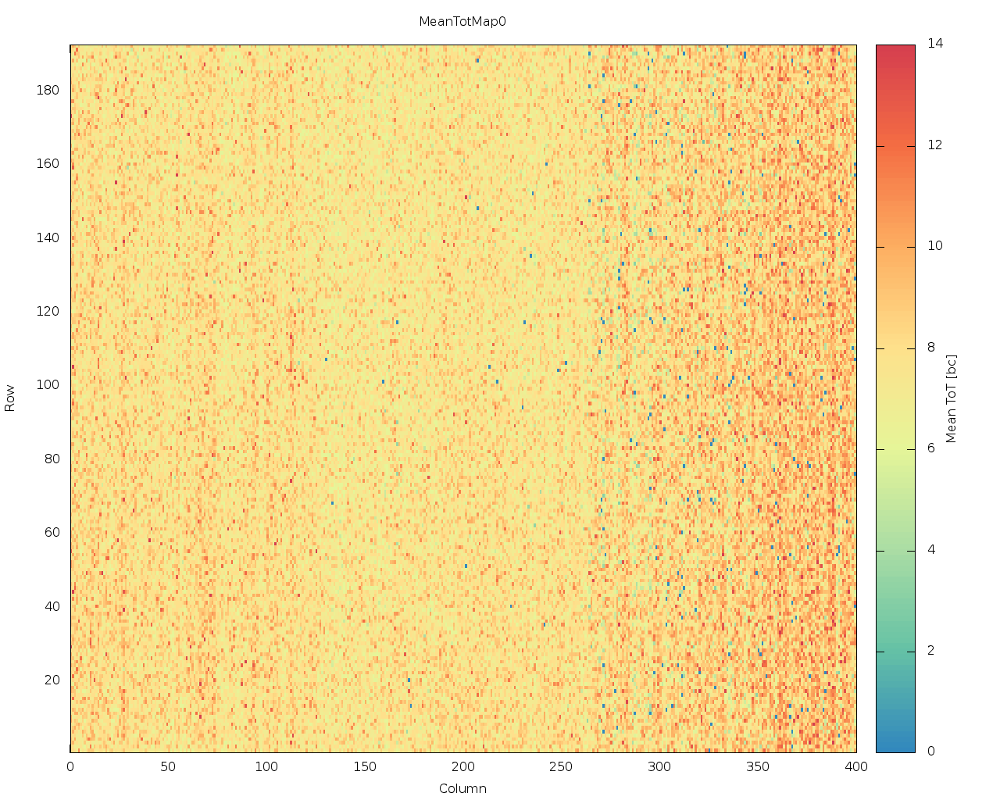
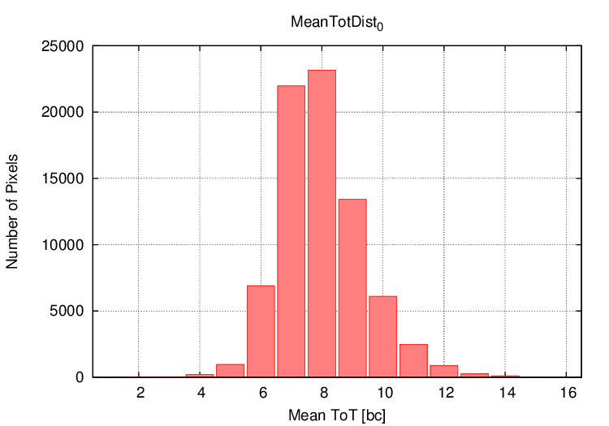


## Cross-talk

For more information please have a look at [this presentation](https://cernbox.cern.ch/index.php/s/1awEj4E3hc0VoDi).

The cross-talk is evaluated injecting in the neighboring pixels and checking the occupancy in the central pixel. 

To check if there is cross-talk for your chip+sensor, use the following command:
```bash
bin/scanConsole -r configs/controller/specCfg.json -c configs/connectivity/example_rd53a_setup.json -s configs/scans/rd53a/std_crosstalk.json  -p
```
For the defaul settings and a fully depleated sensor, the OccupancyMap.png plot should show hits in half of the pixels.

## Cross-talk scan

To identify the threhsold at which cross-talk appear, run the following command:
```bash
bin/scanConsole -r configs/controller/specCfg.json -c configs/connectivity/example_rd53a_setup.json -s configs/scans/rd53a/std_crosstalk_scan.json  -p
```

Config parameters:

 - max ``<int>``: number of mask stages
 - min ``<int>``: mask stage to start with
 - step ``<int>``: step size of mask stage (do not use a value lower than 64)
 - maskType  ``<int>``: for standard threshold scans (0), or for cross-talk (1 or 2 depending on the cross-talk definition)
 - maskSize  ``<int>``: define in which neighbouring pixels charge is injected
 - includedPixels ``<int>``: define if and which pixel edges are not considered to measure cross-talk 
 - sensorType  ``<int>``: square sensor (0), rectangular sensor with bump-bond (0,0) bonded with the pixel at the corner (1), and rectangular sensor with bump-bond (0,1) bonded with the pixel at the corner (2)

The illustration below show the differences between the configurations of `maskType`:

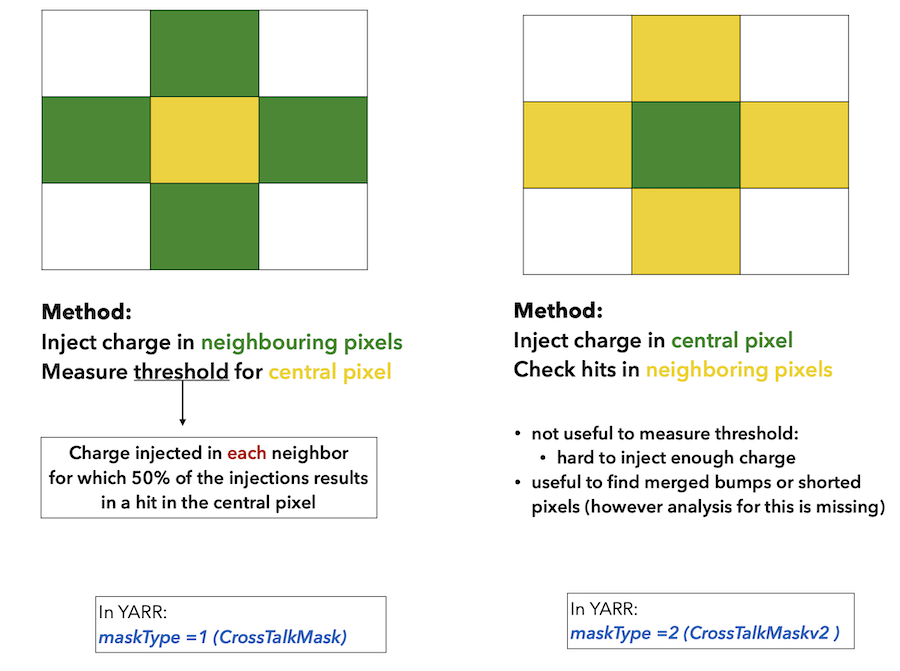

The masSize are illustrated:


The two different sensorType and the impact of maskSize are shown in the following images:
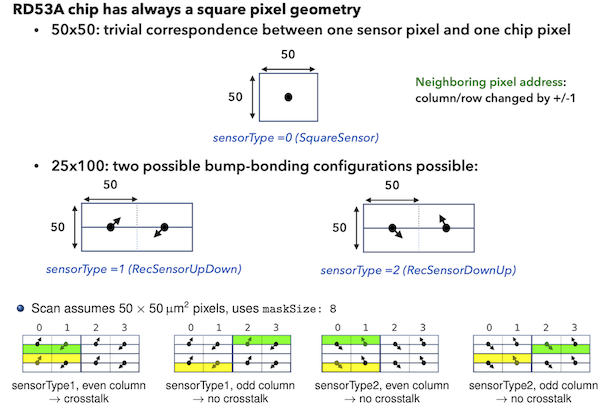

Example of the s-curve, threshold distribution, threshold map and noise distribution for the tuned linear front-end are given below:
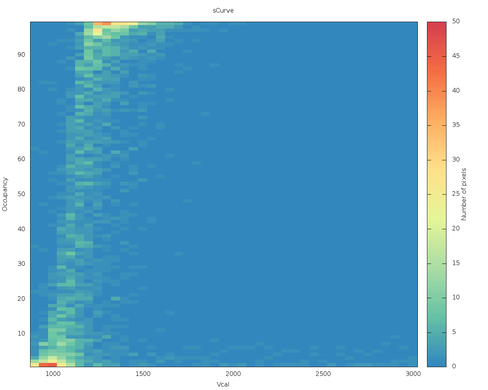
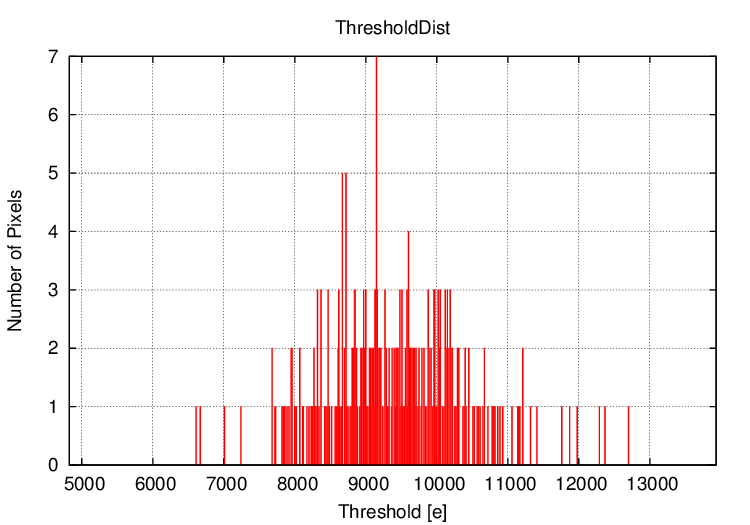

## Cross-talk - check bump bonding scheme

To run do
```bash
bin/scanConsole -r configs/controller/specCfg.json -c configs/connectivity/example_rd53a_setup.json -s configs/scans/rd53a/std_crosstalk_scan_checkBumpBonding.json  -p
```
There are 2 ways to bump bond $25 \times 100 \mu m^2$ sensor pixels onto the $50 \times 50 \mu m^2$ chip pixels. This scan shows crosstalk for sensor type 1 and no crosstalk for sensor type 0 ($50 \times 50 \mu m^2$) or 2 ($25 \times 100 \mu m^2$ but different bump bonding scheme than type 1) as can be distinguished below:


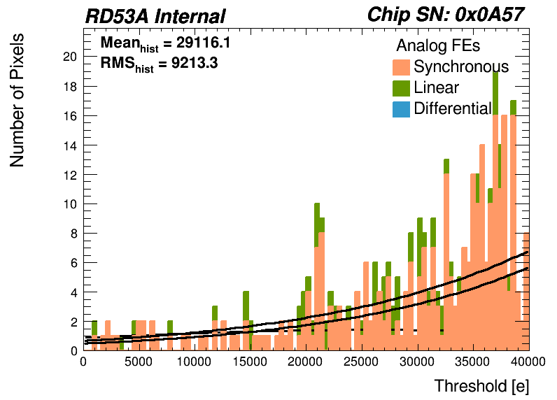


## Disconnected Bump Scan

Uses crosstalk scan to identify pixels without any crosstalk - which are likely be due to disconnected bumps. Based on analog scan with crosstalk mask. This scan uses the same config parameters as the crosstalk scan.
Run the following command:
```bash
bin/scanConsole -r configs/controller/specCfg.json -c configs/connectivity/example_rd53a_setup.json -s configs/scans/rd53a/std_discbumpscan.json  -p
```

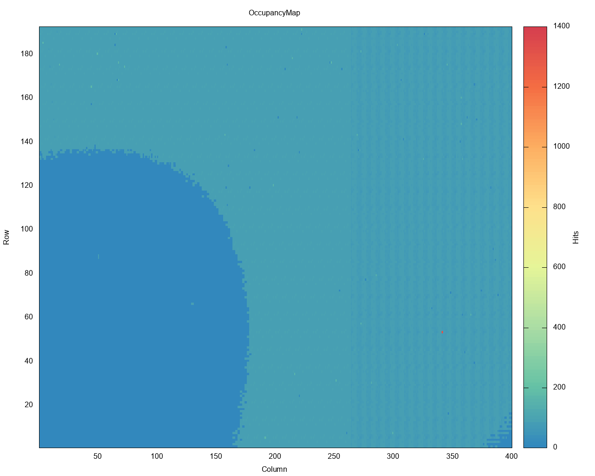

## Source Scan

There are 3 different possibilities for a source scan:
 
 1. noise scan (random trigger)
 2. external trigger scan with Hit-Or ("self-trigger")
 3. external trigger scan with a real trigger, e.g. scintilltor (external trigger)
 
### Random Trigger

Run `std_digitalscan`, `std_analogscan` and at least 3 `std_noisescan` (with the default duration of 5 minutes) before a source scan with random trigger to mask digital/analog bad pixels and noisy pixels.
Modify in `std_noisescan.json`: ``"createMask": false`` and to prevent changing the enable mask and ``"time": 300`` in seconds to set the scan duration.

#### Known Problem (to be verified)

The trigger loop in this scan does not sent an ECR signal during the scan. The sync FE does not delete 0-ToT hits in the buffer and/or the EOC logic gets stuck (with too many hits?) if no ECR is sent. Therefore a stripy pattern can occur in the sync FE.

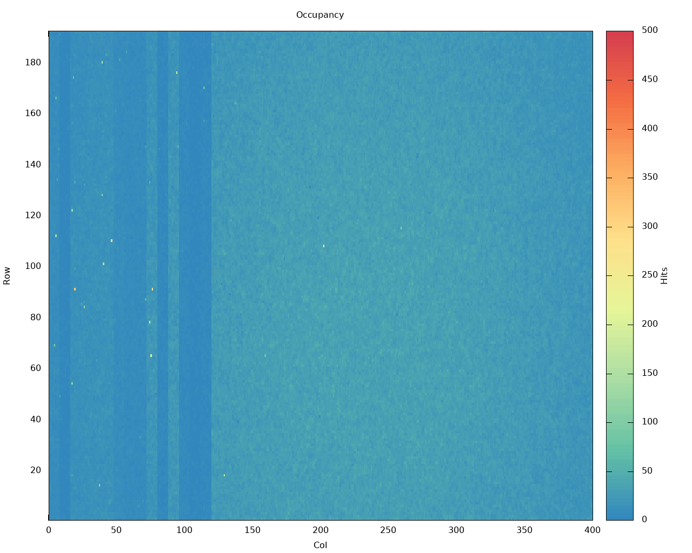

### Hit-Or ("self-trigger")

For the "self-triggering" source scan using Hit-Or as a trigger, a second DP-miniDP cable is needed to connect to the second DP port in the SCC and port B on the Ohio card. The multi-chip firmware cannot be used.
Instead of the `specCfg.json` `specCfgExtTrigger.json` is to be used. The Hit-Or lines have to be enabled in the chip config:
```
"HitOr0MaskDiff0": 65536,
"HitOr0MaskDiff1": 1,
"HitOr0MaskLin0": 65536,
"HitOr0MaskLin1": 1,
"HitOr0MaskSync": 65536,
"HitOr1MaskDiff0": 65536,
"HitOr1MaskDiff1": 1,
"HitOr1MaskLin0": 65536,
"HitOr1MaskLin1": 1,
"HitOr1MaskSync": 65536,
"HitOr2MaskDiff0": 65536,
"HitOr2MaskDiff1": 1,
"HitOr2MaskLin0": 65536,
"HitOr2MaskLin1": 1,
"HitOr2MaskSync": 65536,
"HitOr3MaskDiff0": 65536,
"HitOr3MaskDiff1": 1,
"HitOr3MaskLin0": 65536,
"HitOr3MaskLin1": 1,
"HitOr3MaskSync": 65536,
```

### External trigger

One easy way to use the external trigger scan is to connect a scintillator to a TLU and use the DUT interface with the RJ45 outputs through a RJ45-DP adapter (for EUDET TLU) or with the HDMI outputs using a HDMI-miniDP cable (AIDA TLU).

#### Hardware
 - a scintillator with a PMT
 - an EUDET TLU
   - a RJ45 cable
   - a RJ45-DP converter
   - a second DP-miniDP cable
 - OR an AIDA TLU
   - HDMI-miniDP cable
 
#### Installation

For running the TLU in standalone mode you need to install ``libusb`` and ``libusb-devel`` version 0.1 (!) on your (CentOS) computer.
Get eudaq from [here](https://github.com/eudaq/eudaq/tree/master/user/tlu) and compile it with ``USER_TLU_BUILD=ON`` option.
The TLU only produces trigger when the software is running with e.g. ``./EudetTluControl -a 1 -hm 0 -d 1 -i RJ45 -q``. Please refer to the [TLU manual](https://twiki.cern.ch/twiki/bin/view/MimosaTelescope/TLU) for the options.

The second DP-miniDP cable connects the RJ45-DP connector to port D which should accept TLU input with the non-multichip FW on the FPGA.


# Loop Actions

List of available loop actions and their configuration parameters.

## Rd53aTriggerLoop
Will repeatably send a 512-bit command from the burst buffer to the FE.

Config parameters:
    
- count ``<int>``: number of injections, if 0 will run for specified time (default 50/100)
- delay ``<int>``: time gap in bunch crossings between injection and trigger, should be divisible by 8 (default 56)
- extTrigger ``<bool>``: enable external triggering, requires proper trigger processors configuration (default false)
- frequency ``<int>``: trigger(/injection)frequency in Hz (default 5000)
- noInject ``<bool>``: disable charge injection (e.g. for noise scan) (default false)
- time ``<int>``: time in seconds, if count is set to 0 will run for this amount of time (default 0)
- edgeMode ``<bool>``: switches cal injection command to edge mode, e.g. for digital scan (default false)

## Rd53aCoreColLoop
Loops of core columns in specified pattern

Config parameters:
    
- max ``<int>``: upper bound of cores to scan
- min ``<int>``: lower bound of cores to scan
- step ``<int>``: step size (1 will scan all cores, more than 1 will skip cores)
- nSteps ``<int>``: how many steps should be used to scan over cores

## Rd53aMaskLoop
Loops over pixels. All pixels in one core column are serialized on the following fashion.
    
```
unsigned serial = (core_row*64)+((col+(core_row%8))%8)*8+row%8;
```

The maximum of the loops defines how many pixels should be activated at one time. E.g. if the max is 64 that means every 64th pixel (1 pixel per core) and requires 64 steps to loop over all pixels. A pattern of enabled pixels in each mask step for ``max = 16`` can be found [here](https://docs.google.com/spreadsheets/d/1VXZn-fp16U6Rsu_GvGmq_fWgU0qwa0niilJ82ZQOYY8/edit?usp=sharing)

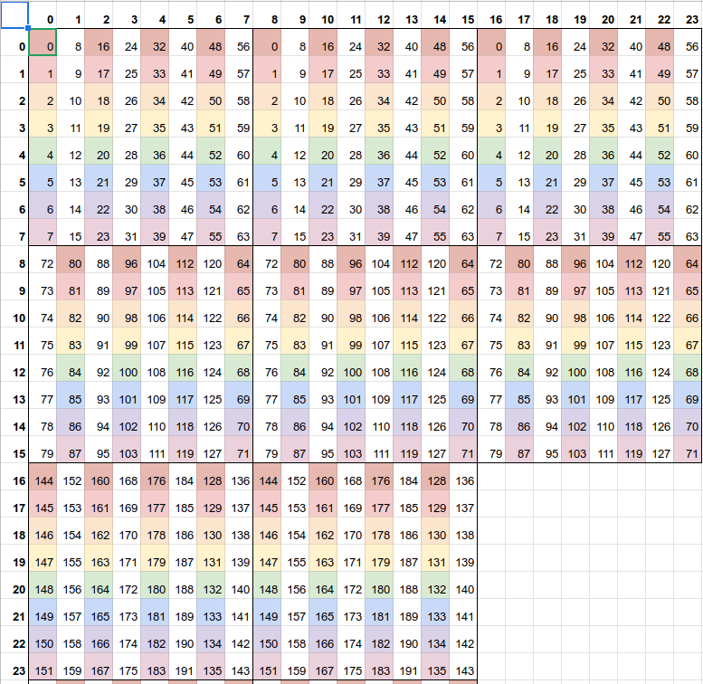

Config parameters:

 - max ``<int>``: number of mask stages
 - min ``<int>``: mask stage to start with
 - step ``<int>``: step size of mask stage

## Rd53aParameterLoop
Loops over a specifed range of an RD53A global register

Config parameters:

- min ``<int>``: start value (inclusive)
- max ``<int>``: end value (inclusive)
- step ``<int>``: parameter step size
- parameter ``<string>``: name of the global register (as in chip config)

## Rd53aGlobalFeedback
Receives feedback from the selected analysis algorithm and adjusts the selected RD53A global register.

Config parameters:

- min ``<int>``: absolute minimum register setting
- max ``<int>``: start value
- step ``<int>``: stepsize of tuning (might change depending on algorithm)
- parameter ``<string>``: name of the global register (as in chip config) to tune
- pixelRegs ``<0,1,2,3>``: `0` (default) does not change TDACs, `1` sets all TDACs to default, `2` sets all TDACs to max, `3` sets all TDACs to min 

## Rd53aPixelFeedback
Receives feedback from the selected analysis algorithm and adjusts the selected RD53A pixel TDAC register.

Config parameters:

- min ``<int>``: absolute minium setting
- max ``<int>``: absolute max setting
- steps ``<array<int>>``: size and number of tuning steps to be performed
- tuneDiff ``<bool>``: enable adjustment of diff FE pixel regs
- tuneLin ``<bool>``: enable adjustment of lin FE pixel regs
- resetTdac ``<bool>``: reset TDACs to defaults

## Disabling FEs

The default values for the FEs in the chip configuration are

- `EnCoreColDiff1`: 65535; enables each bit in the 16 core columns (2^16 = 65535) 
- `EnCoreColDiff2`: 1; enables the 17th core column
- `EnCoreColLin1`: 65535; enables each bit in the 16 core columns
- `EnCoreColLin2`: 1; enables the 17th core column
- `EnCoreColSync`: 65535; enables each bit in the 16 core columns

To disable a FE, you need to set the appropriate `EnCoreCol` to 0.

# Running RD53a in ShuLDO mode

To see the SCC in shunt mode,

## Shunt resistors
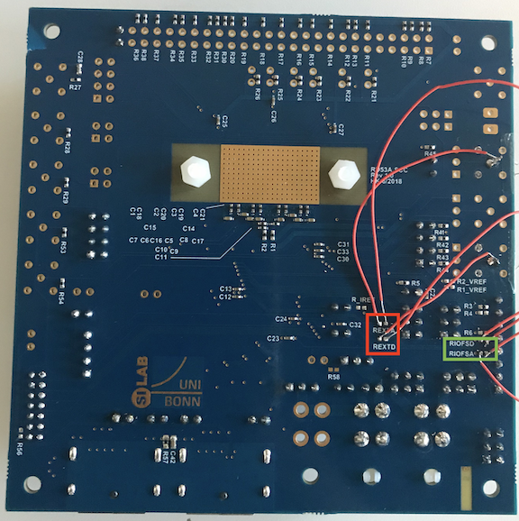

4 shunt resistors need to be soldered on the back of the SCC, pictured above:
- RextA: analog external resistor, resistor that sets the slope for the analog shunt IV. The value of this resistor is `1.15k` ohm.
- RextD: digital external resistor, resistor that sets the slope for the digital shunt IV. The value of this resistor is `1.07k` ohm.
- RIoffsA: analog offset resistor, resistor that sets the offset for the analog IV curve. The value of this resistor is `232k` ohm.
- RIoffsD: digital offset resistor, resistor that sets the offset for the digital IV curve. The value of this resistor is `226k` ohm.

## Jumper configuration
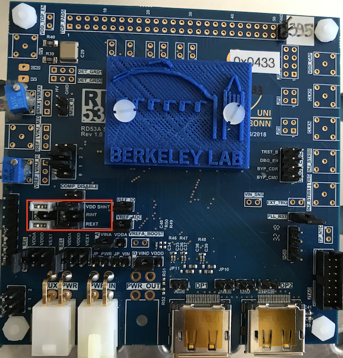

In addition to soldering shunt resistors, jumpers are needed to select the ShuLDO operation mode.
- VDD Shnt A and VDD Shnt D: select shunt mode operation
- Rext A and Rext D: select slope resistors soldered on the SCC as opposed to the internal shunt resistors

## Shunt mode operation
LDO mode is set in <span style="color:red">constant voltage</span>, where the power supply voltage is set and the current consumed by the chip can be measured.

In shunt mode, the power supply is set in <span style="color:red">constant current</span> mode. The maximum voltage is set to <span style="color:red">**1.8 V**</span>, and the current is set to <span style="color:red">**1.1 A**</span>. The current to the chip will be 1.1 A and the voltage measured is 1.6 V (less than the maximum value of 1.8V).

All scans described above can be performed in shunt mode.


# Running with multiple RD53a chips

Before, we described operation on a single-chip card; however, when testing triplets or quads, there will be 3-4 FE ends so operation is a little bit different.

In case you run into problems running with multiple chips, please consult the troubleshooting page here: [Troubleshooting](troubleshooting)

## Multiple PCIexpress cards
Each PCIexpress card has its own `specNum`; therefore, the user needs to creat one specCfg.json per PCIExpress card. More details about the controller configurations can be found in [ScanConsole](scanconsole).

## Each RD53a receives its own command
For each chip to receive its own command, the connectivity configuration needs to specify the `tx`, `rx`, and `enable` for each chip. More explanations about these can be found in [ScanConsole](scanconsole).

An example configuration set to communicate with multiple FEs looks like this:
```json
{
    "chipType" : "RD53A",
    "chips" : [
        {
            "config" : "configs/rd53a_TripletA_IndCmdChipA.json",
            "tx" : 0,
            "rx" : 0,
            "enable" : 1,
            "locked" : 0
        },
        {
            "config" : "configs/rd53a_TripletA_IndCmdChipB.json",
            "tx" : 1,
            "rx" : 1,
            "enable" : 0,
            "locked" : 0
        },
        {
            "config" : "configs/rd53a_TripletA_IndCmdChipC.json",
            "tx" : 2,
            "rx" : 2,
            "enable" : 1,
            "locked" : 0
        }
    ]
}
```
Each chip is given its own configuration file named, labeled under `config`. In this example, the 2nd chip (tx/rx 1 is disabled) but all remaining chips are enabled.

After running a scan or just running scanConsole without running a scan, a configuration for each chip will be created. The `ChipId` for each FE will be set to 0 (default). You must change this value to match the wire-bonded value in each configuration. More details about this can be found in [ScanConsole](scanconsole).

### Running scans with multiple chips
The scans will be run on all chips that are enabled. If an error occurs, it will be associated with a number.
```bash
629258304 [1] Received data not valid: [17723,50400] = 0xcc53ff2f
```
In the above example, chip with tx/rx 1 did not receive valid data.

## Multiple RD53a chips share one command line but different data lines
An example would be:
```json
{
    "chipType" : "RD53A",
    "chips" : [

        {
            "config" : "configs/rd53a_Quad_ChipA.json",
            "tx" : 0,
            "rx" : 0,
            "enable" : 1,
            "locked" : 0
        },
        {
            "config" : "configs/rd53a_Quad_ChipB.json",
            "tx" : 0,
            "rx" : 1,
            "enable" : 1,
            "locked" : 0
        }
    ]
}
```
In the above configuration, the command will be sent using tx0 but each chip uses its own rx line.

## Running quad modules
To run quad modules, you need to set up the chips such that all 4 chips share one command line, as described above.

If you have a 4-display port adaptor card, you only need to share the command line but can use different display ports for the return data.

Additional changes for the quad module's chip configurations:

- `ChipId`: the ChipId for each chip should be set according to wirebonding map (Chip1-1, Chip2-2,Chip3-3,Chip4-4)
- `OutputActiveLanes`: 7 instead of 15 because only 3 data lanes are connected, not 4
