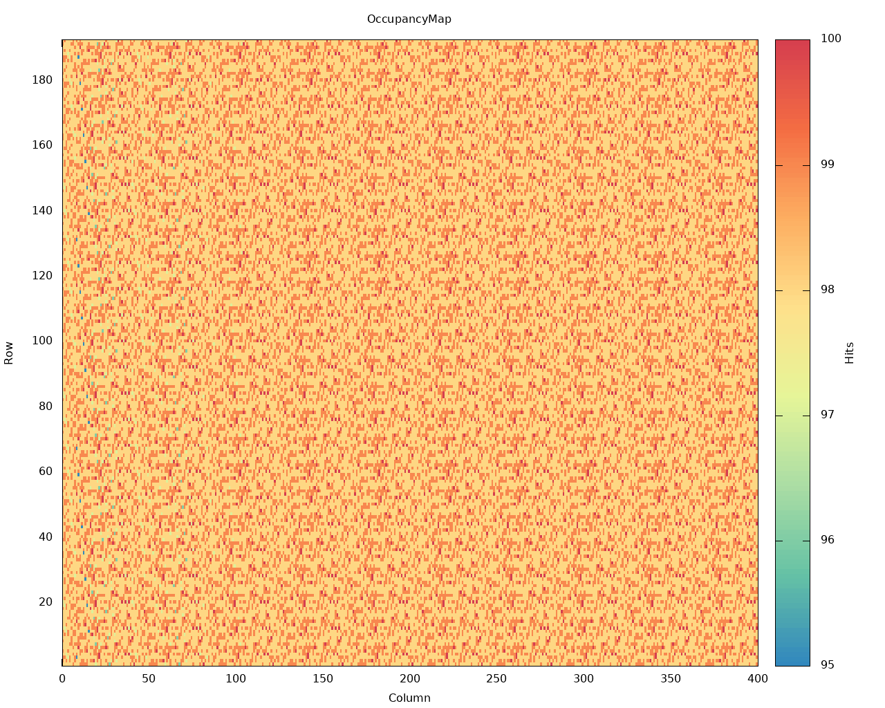
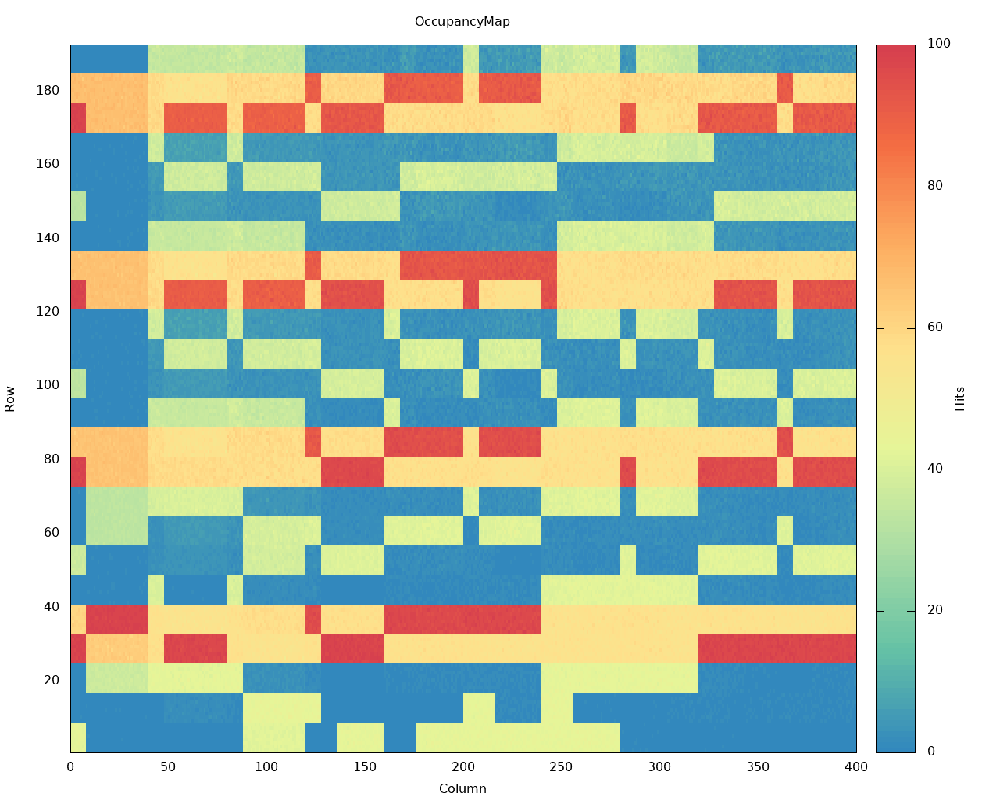

# Troubleshooting

The topics in this section are ordered in increasing complexity. If a problem occurs the best way is to start at the basics and crosscheck those first to exclude them. Knowing that these points have been crosschecked will help if further support is needed.


## Firmware Troubleshooting

If you encounter errors concerning permissions, e.g. 
```
# open_hw_target
ERROR: [Labtoolstcl 44-469] There is no current hw_target.
```
try installing cable drivers:

```
cd /opt/Xilinx/Vivado/2020.1/data/xicom/cable_drivers/lin64/install_script/install_drivers/
sudo ./install_drivers
```

Alternatively you might have to add a ``udev`` rule. Run ``lsusb`` and identify your JTAG cable, e.g. ``Bus 001 Device 007: ID 0403:6014``.
Open ``/etc/udev/rules.d/99-usb.rules`` and add the line
```
SUBSYSTEMS=="usb", ATTRS{idVendor}=="0403", ATTRS{idProduct}=="6014", MODE:="0666"
```
with the correct vendor and product ID from ``lsusb``. Reload ``udev`` rules with
```
sudo udevadm control --reload-rules && sudo udevadm trigger
```

### Centos 8

#### Kernel driver does not load on start up
In ``/etc/modules-load.d/`` add a line to a config file (or create one if none existing) e.g. ``modules.conf`` with ``specDriver``

#### Installing Vivado
```
No protocol specified
No protocol specified
ERROR: Installer could not be started. Could not initialize class java.awt.GraphicsEnvironment$LocalGE
java.lang.NoClassDefFoundError: Could not initialize class java.awt.GraphicsEnvironment$LocalGE
	at java.desktop/java.awt.GraphicsEnvironment.getLocalGraphicsEnvironment(GraphicsEnvironment.java:129)
	at java.desktop/java.awt.Window.initGC(Window.java:487)
	at java.desktop/java.awt.Window.init(Window.java:507)
	at java.desktop/java.awt.Window.<init>(Window.java:549)
	at java.desktop/java.awt.Frame.<init>(Frame.java:423)
	at java.desktop/java.awt.Frame.<init>(Frame.java:388)
	at java.desktop/javax.swing.JFrame.<init>(JFrame.java:180)
	at h.b.<init>(Unknown Source)
	at com.xilinx.installer.gui.F.<init>(Unknown Source)
	at com.xilinx.installer.gui.InstallerGUI.<init>(Unknown Source)
	at com.xilinx.installer.gui.InstallerGUI.<clinit>(Unknown Source)
	at com.xilinx.installer.api.InstallerLauncher.main(Unknown Source)
```

Execute ``xhost +``.

#### Couldn't load "librdi_commontasks.so": libtinfo.so.5

```
application-specific initialization failed: couldn't load file "librdi_commontasks.so": libtinfo.so.5: cannot open shared object file: No such file or directory
```

In ``/usr/lib64`` make a symblink ``sudo ln -s libtinfo.so.6 libtinfo.so.5``.


## PCIe Card Troubleshooting

The following points are specific to PCIe cards.

### Check if the PCIe card is identified by the System

- You can check if the card is enumerated by the system with ``lspci``
- For Series 7 FPGAs:

```bash
$ lspci
<Some text>
02:00.0 Signal processing controller: Xilinx Corporation Device 7024
<Possibly more text>
```

    - For the CERN SPEC card

```bash
$ lspci
<Some text>
01:00.0 Non-VGA unclassified device: CERN/ECP/EDU Device 018d (rev 03)
<Possibly more text>
```

- If card does not show up this can have multiple reasons.
    - SPEC card: this means an incompatibility with the motherboard, and the solution would be to switch to another computer.
    - Series 7 FPGA: 
        - If the FPGA is not fully programmed at boot time, the system might not enumerate it. Try performing a 'soft-reboot' where the power is not cut and the FPGA stays programmed.
        - Try reprogramming the firmware in case something went wrong during the firmware setup stage.
        - It has been observed that some machiens seem to be FPGA unfriendly, specifically DELL and HP computers. A list of compatible motherboards can be found [here](compatability.md)

### Check if the DMA transfers works correctly

- You can check the DMA transfer with the PCIe card with ``test`` program:

```bash
$ cd Yarr/src
$ bin/specComTest
[15:17:55:415][  info  ][  specComTest  ]: Init spec
[15:17:55:415][  info  ][    SpecCom    ]: Opening SPEC with id #0
[15:17:55:415][  info  ][    SpecCom    ]: Mapping BARs ...
[15:17:55:415][  info  ][    SpecCom    ]: ... Mapped BAR0 at 0x7f8557772000 with size 1048576
[15:17:55:415][warning ][    SpecCom    ]: ... BAR4 not mapped (Mmap failed)
[15:17:55:415][  info  ][    SpecCom    ]: ~~~~~~~~~~~~~~~~~~~~~~~~~~~
[15:17:55:415][  info  ][    SpecCom    ]: Firmware Version: 0xf4ef308
[15:17:55:415][  info  ][    SpecCom    ]: Firmware Identifier: 0x1030231
[15:17:55:415][  info  ][    SpecCom    ]: FPGA card: Trenz TEF1001_R1
[15:17:55:415][  info  ][    SpecCom    ]: FE Chip Type: RD53A/B
[15:17:55:415][  info  ][    SpecCom    ]: FMC Card Type: Ohio Card (Display Port)
[15:17:55:415][  info  ][    SpecCom    ]: RX Speed: 640Mbps
[15:17:55:415][  info  ][    SpecCom    ]: Channel Configuration: 4x4
[15:17:55:415][  info  ][    SpecCom    ]: ~~~~~~~~~~~~~~~~~~~~~~~~~~~
[15:17:55:415][  info  ][    SpecCom    ]: Flushing buffers ...
[15:17:55:415][  info  ][    SpecCom    ]: Init success!
[15:17:55:415][  info  ][  specComTest  ]: Starting DMA write/read test ...
[15:17:55:415][  info  ][  specComTest  ]: ... writing 8192 byte.
[15:17:55:416][  info  ][  specComTest  ]: ... read 8192 byte.
[15:17:55:416][  info  ][  specComTest  ]: Success! No errors.
```

- If this program returns any kind of other output, there is a problem with the DMA transfer. This can be caused by multiple things:
    - Corrupt firmware: while it should not happen if there was a problem while the firmware was synthesized. You can try flashing a different firmware, this test does not use the adapter card hence all firmware types should work.
    - It has been observed that there are sometimes hardware and kernel level incompatiblites which cause DMA transfers to fail. Please contact a developer if the previous step did not fix it.

## ScanConsole Troubleshooting

...

## RD53B Troubleshooting

...

## RD53A Troubleshooting

### Chip fails communication test

**Symptom**: Chip fails com test (register readback) in scan console. Either because chip does not configure or there are readout errors.

**Resolve by:**

- Check that the wire-bonded chip ID matches the number set in the configuration, `ChipId`. The default ChipId is 0 in the configuration, but for a triplet or a quad, each RD53a would be wire-bonded with a different number.
- Try power-cycling the chip.
- Make sure the DP cable is plugged into the right ports and you have selected the correct Tx/Rx links in the connectivity.
- Meausure the analog regulator output voltage, if below 1.1V consider installing a Vref hack (ask experts).
- Increase or decrease the ``SldoAnalogTrim`` and ``SldoDigitalTrim`` register (try going in steps by 5) or tune them to output 1.2V
- Increase or decrease the ``CmlTapBias0`` register (try testing in steps of 100)
- Try a different kind of DisplayPort cable (typically short is better)
- Try a better/different kind of power cable (try jiggeling the power cable)
- If all above fails: try operating in direct powering.


Jumper configuration for **direct powering**

- PWR_A and PWR_D: VDDA and VDDD (direct powering)
- VDD_PLL_SEL: VDDA (PLL driver from VDDA supply)
- VDD_CML_SEL: VDDA (CML driver from VDDA supply)
- VREF_ADC (internal ADC voltage reference)
- IREF_IO (internal current refetrence)
- IREF_TRIM: Jumper to 3 to set the internal reference current at 4 μA
- Set the power supply to 1.30 V, the current should be 0.41 A
- Turn off the command from the FPGA and turn on the power supply

**Make sure that the jumper configuration marked in red is correct before powering the chip!!! <span style="color:red"> Do not apply higher voltage than 1.30 V</span>. Applying too high voltage may kill the chip.**


### Problem with the digital scan

**Symptom:** The digital scan looks blocky (see picture)


**Resolve by:** check that aurora lines are connected and running. The jumpers JP10 and JP11 on the SCC have to be closed in order to use LANE 2 and LANE 3.


**Symptom:** There seems to be loss of data.



**Resolve by:** Check the firmware configuration, OutputActiveLanes, and the trigger frequency. Try using a firmware with higher readout frequency, e.g. 640 MHz instead of 160 MHz, more lanes in the chip (e.g. 3 or 4 lanes instead of 1 lane), or lower trigger frequency in the scan config (e.g. use 5000 Hz instead of 30 kHz).


### Noise/Source Scan is empty

**Symptom:**

- Noise/Source scan (or similar) has 0 hits

**Resolve by:**

- Check that your enable mask is not all `0`


## FE-I4 Troubleshooting

## FE65-P2 Troubleshooting

